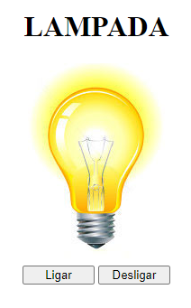

<h1 align="center"> Lampada </h1>

Projeto sobre uma simples Lampada com foco em JavaScript.  

  <a href="#-tecnologias">Tecnologias</a>&nbsp;&nbsp;&nbsp;|&nbsp;&nbsp;&nbsp;
  <a href="#-projeto">Projeto</a>&nbsp;&nbsp;&nbsp;|&nbsp;&nbsp;&nbsp;
  <a href="#memo-licença">Licença</a>

  

 

  

## 🚀 Tecnologias

Esse projeto foi desenvolvido com as seguintes tecnologias:

- HTML
- CSS
- JavaScript
- Github

## 💻 Projeto

Uma simples interface com o proposito de ações do javascript, como: "Ligar", "Desligar" e "Quebrar" ao clicar 2x na lampada.

## :memo: Licença

Esse projeto está sob a licença MIT.